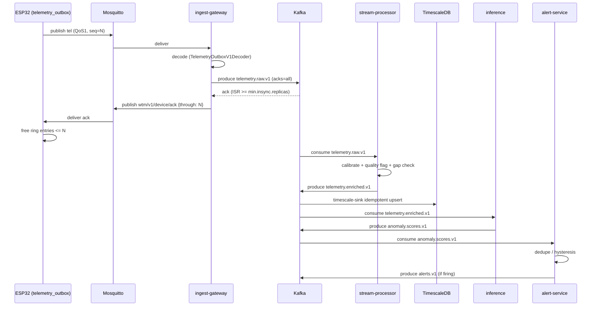

# Architecture

This is the source of truth for the system design — the diagrams here are
Mermaid source, checked into version control, and the same source renders in
the [published diagram artifact](https://claude.ai/code/artifact/a480a332-f03d-4a0b-92ec-f8211507871a)
so the two never drift apart. When the architecture changes, edit this file
first, then republish the artifact from the same source.

For what is real today versus scaffolded, see each component's section
below and `docs/claims.md`.

## System overview

```mermaid
flowchart TB
    subgraph EDGE["Edge — firmware/"]
        WT["ESP32-C3 water-tank\nAJ-SR04M · NTC · RSSI"]
        PC["ESP32-C3 pump-controller\nrelay · runtime watchdog\ndry-run guard"]
        OUT["telemetry_outbox\nRTC ring buffer + seq"]
        WT --> OUT
    end

    OUT -- "MQTT QoS1\nwtm/v1/device/tel" --> BROKER[["Mosquitto\nmax_queued_messages=0"]]
    BROKER -- "wtm/v1/device/ack" --> OUT
    BROKER -- "level/pct (retained)" -.-> PC

    subgraph PLATFORM["platform/ — Java 25 / Spring Boot"]
        GW["ingest-gateway\ndecode → validate → publish → ack"]
        SP["stream-processor\ncalibration · quality · gap detection"]
        SINK["timescale-sink\nidempotent upsert"]
        ALERT["alert-service\nAlert lifecycle"]
        API["operations-api\nREST + WebSocket"]
    end

    BROKER --> GW
    GW -- "acks=all\nmin.insync.replicas=2" --> KAFKA[("Kafka\ntelemetry.raw.v1")]
    KAFKA --> SP
    SP -- "telemetry.enriched.v1" --> SINK
    SP -- "telemetry.enriched.v1" --> INF
    SINK --> TSDB[("TimescaleDB")]

    subgraph ML["ml/ — Python"]
        INF["inference\nAnomalyDetector"]
        TRAIN["training\nTrainingPipeline"]
    end

    INF -- "anomaly.scores.v1" --> ALERT
    TSDB -. "snapshot" .-> TRAIN
    TRAIN -. "registered model" .-> INF

    ALERT -- "alerts.v1" --> API
    TSDB --> API
    API -- "STOMP/WebSocket" --> CONSOLE["console/\noperator dashboard"]

    SIM["simulator/\nsynthetic + fault injection"] -. "load / replay" .-> BROKER
```

## Data pipeline sequence

What happens to one reading, end to end:



Note the ordering in the first four steps: **the device is not told it may
forget the data until Kafka has durably replicated it.** That ordering is
the entire durability contract — see the table below and
`IngestTelemetryBatchUseCase` in `platform/domain`.

## The durability chain

Each row is a real failure mode; the mechanism is what actually prevents it,
not the general claim of "reliability".

| Where it could be lost | Mechanism |
|---|---|
| Device asleep ~80% of the time; WiFi down at wake | `telemetry_outbox`'s RTC-memory ring buffer (~300 records ≈ 12.5h) plus NVS overflow tier (~10k records ≈ 17 days). Beyond that: a detected gap, never silent loss. |
| MQTT fire-and-forget | QoS 1, `clean_session=false`. Necessary, not sufficient — a PUBACK only proves the broker has it, not Kafka. |
| Gateway frees the device's buffer before Kafka has the record | Application-level ack: the gateway publishes `wtm/v1/<id>/ack` only *after* `TelemetryPublisherPort.publish()`'s stage completes. See `IngestTelemetryBatchUseCase.handle`. |
| Broker silently drops a queued message | Mosquitto's default `max_queued_messages` (1000) discards past that count. `infra/mosquitto/mosquitto.conf` sets it to 0 with a byte cap instead. |
| Producer retry duplicates or drops | `acks=all`, `enable.idempotence=true`, `retries=MAX_VALUE` — see `DurableKafkaProducerConfig`. |
| Broker dies mid-write | Topic `min.insync.replicas=2` with `RF=3` (production topology; local dev compose is single-broker and cannot enforce this — see below). |
| Consumer crashes after processing, before offset commit | At-least-once + idempotent upsert on `(device_id, boot_id, seq)` in `timescale-sink`. |
| Transient failure routed to the DLQ | Forbidden by design: only deterministic decode failures ("poison") are dead-lettered; transient failures retry with the consumer paused. See `DeadLetterPort`'s Javadoc. |
| No measurement of loss | `GapDetectionTransformer` tracks per-device, per-boot contiguity and emits `ingest.gap.v1` when an ordered Kafka partition reveals a hole; `IngestGapKafkaConsumer` persists the missing range. A zero-loss claim with nothing measuring loss is unfalsifiable. |

**Local dev environment caveat:** `infra/docker-compose.yml` runs one Kafka
broker. `min.insync.replicas=2` cannot hold on one broker, so a green run
against local compose proves nothing about the durability claim. The M4
harness in `tools/chaos/` provisions a 3-broker kind cluster, enforces RF=3
and `min.insync.replicas=2`, deletes one broker during sustained MQTT load,
and compares every expected `(device_id, boot_id, seq)` against
`telemetry.raw.v1`. The recorded 2026-08-25 Podman-backed run conserved all
4,000 records with complete application acknowledgements and recovered every
partition to full ISR after broker replacement; see
`docs/evidence/zero-loss-conservation-2026-08-25.md`. This is bounded evidence
for that scenario, not a universal guarantee across all loads and failures.

## Language responsibilities

- **Java / Spring Boot** (`platform/`) owns everything transactional,
  stateful, or on the durability critical path: the gateway, stream
  processing, persistence, alert lifecycle, and the operator API.
- **Python** (`ml/`) owns everything model-shaped: feature engineering,
  training, evaluation, and real-time inference. `ml/src/telemetry_ml/features`
  is imported by both the training pipeline and (once built) the inference
  consumer — the single mechanism that prevents training/serving skew.
- **C++ (ESPHome external components)** owns the constrained edge loop. See
  "where OOD is the wrong tool" below.

## Object-oriented design

**Java: hexagonal.** `platform/domain` has zero Spring/Kafka/JDBC imports —
enforced by `NoFrameworkDependenciesTest` (ArchUnit), which fails the build
if that ever stops being true. Ports (`TelemetryPublisherPort`,
`TelemetryRepository`, ...) are declared in the domain; adapters
(`KafkaTelemetryPublisherAdapter`, ...) implement them in each service
module. This is what makes `IngestTelemetryBatchUseCase` unit-testable in
milliseconds with no broker or database running.

Patterns used, and why each earns its place:

- **Strategy** — `CalibrationStrategy` (tank geometry and installer
  calibration genuinely vary) and the planned `AlertPolicy`.
- **Factory/registry** — `FrameDecoderFactory`: a device fleet upgrades
  gradually, so the gateway must keep decoding every wire version any
  still-deployed firmware speaks. Contrast with `jsn_sr04t.cpp`'s
  `switch (model_)`, which is correct in that spot — a closed, two-element
  set with no DI container.
- **Repository / Ports & Adapters** — the whole domain/adapter split above.

**Where a pattern was deliberately *not* used:** `Alert`'s lifecycle is a
textbook GoF State candidate and uses a plain enum plus an explicit
transition table instead — five state classes would buy nothing over a
`Map<AlertState, Set<AlertState>>` for a state machine with no per-state
behavioral variation. See `Alert.java`.

**Python: Template Method.** `TrainingPipeline.run()` is a fixed sequence —
load, engineer features, `split_temporal` (never random), fit a scaler on
train only, fit the model, calibrate a threshold on validation only,
evaluate on test exactly once. A subclass (`ZScoreBaselinePipeline`, and
eventually an LSTM pipeline) cannot skip a step or peek at test data,
because it only ever receives the slice the skeleton hands it. This is what
makes a reported accuracy number trustworthy rather than aspirational.

**Where OOD is the wrong tool:**

- `firmware/components/telemetry_outbox`'s ring buffer is a POD struct in
  RTC memory — no vtables, no constructors, no heap. A vtable pointer
  surviving deep sleep across an OTA update is undefined behavior. See
  `docs/DECISIONS/0005-pod-structs-in-rtc-memory.md`.
- `ml/src/telemetry_ml/features` is pure functions over DataFrames, not a
  `FeatureExtractor` class hierarchy — a class here would carry state, and
  state is exactly what causes training/serving skew.
- Kafka Streams topologies (`stream-processor`) stay a dataflow function,
  not an object graph — the DSL is already the right abstraction.

## Repository layout

```
firmware/         ESPHome configs + external components (the edge)
hardware/         KiCad PCB design
console/          React 19 / TypeScript operator console (REST + STOMP)
platform/         Java 25 / Spring Boot, Gradle multi-module
  domain/           pure — no framework imports (ArchUnit-enforced)
  ingest-gateway/    MQTT -> Kafka durability chain
  stream-processor/  Kafka Streams: calibration, quality, gap detection
  alert-service/     Alert aggregate + lifecycle
  operations-api/    REST + WebSocket for console/
  timescale-sink/    idempotent persistence
  testing-support/   shared Testcontainers fixtures
ml/               Python: features, training pipeline, detectors
simulator/        synthetic telemetry + fault injection, same wire format
infra/            Podman/Docker Compose (dev only — see caveat above)
docs/             this file, ADRs, claims mapping
```

## What is scaffolded vs. implemented today

See `docs/claims.md` for the bullet-by-bullet mapping this file supports.
In short: firmware is fixed and schema-validated against real ESPHome;
`platform/domain` is complete and fully tested; `ingest-gateway` has its two
most consequential pieces (the decoder and the durable producer) built and
compiling, with the MQTT inbound wiring still to do; the other four Java
services are structural scaffolds (a real, compiling Spring Boot app with a
documented responsibility, not yet business logic); `ml/` has a working,
tested Template Method pipeline and baseline detectors; `simulator/` is
fully working. Nothing here has been validated against real, multi-broker
Kafka or real hardware — see docs/claims.md for exactly what is and is not
yet demonstrated.
